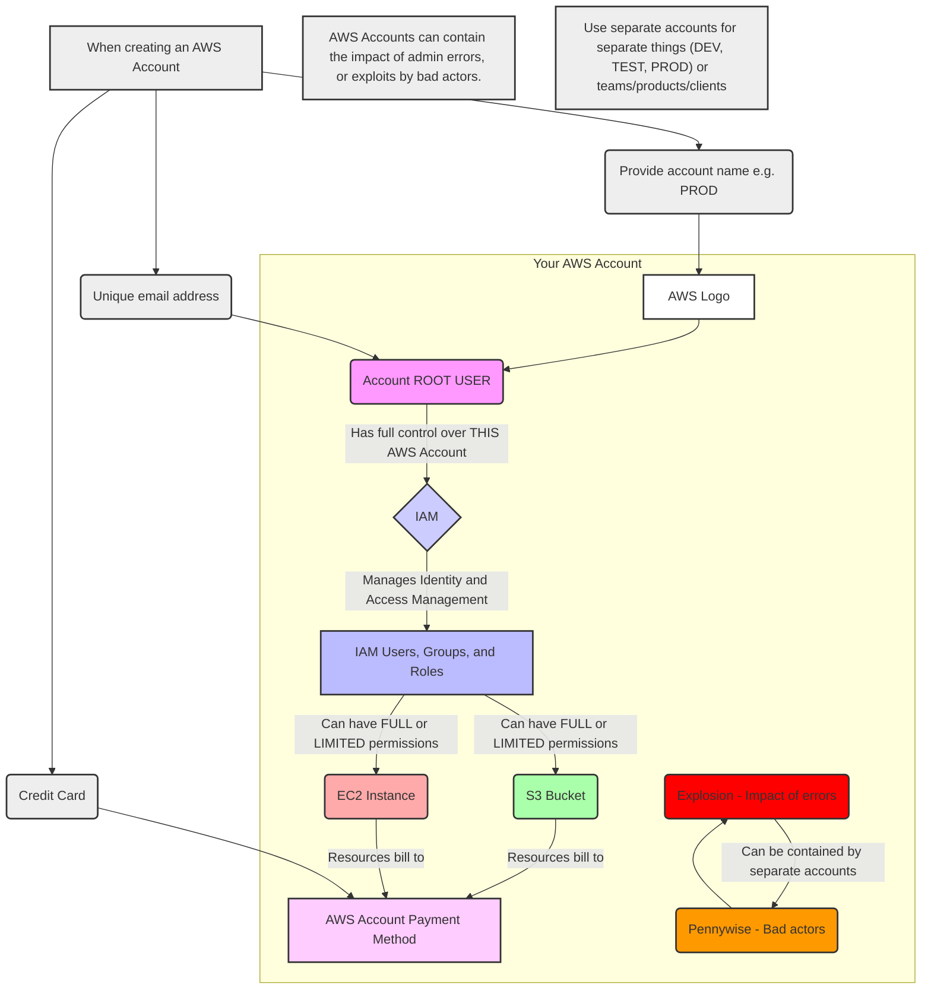
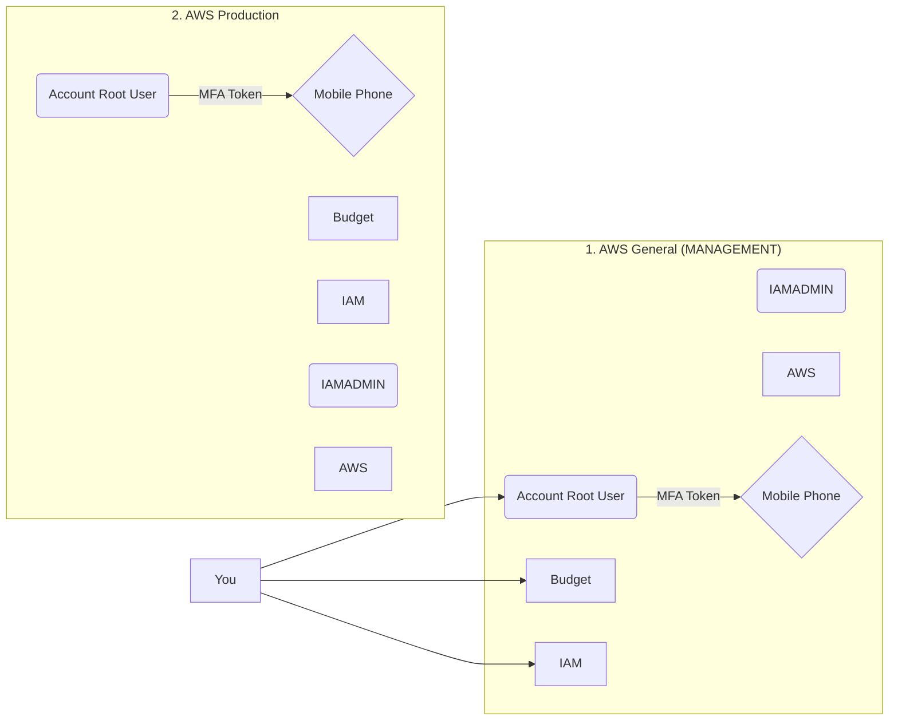
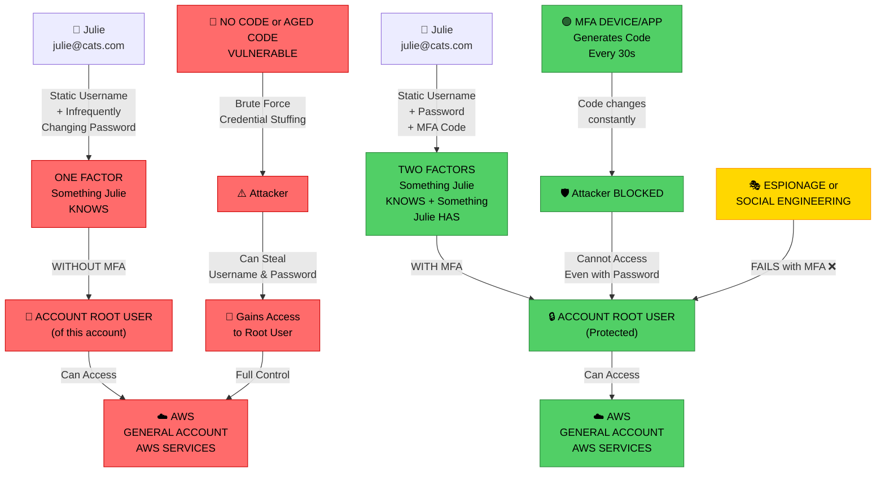

# AWS - Solution Architect Associate - A Complete Guide

## AWS Accounts - The Basics

An AWS Account serves as a container for both identities (users) and resources. When creating an AWS account, you must provide an account name (e.g., PROD), a unique email address (each account requires a distinct email), and a credit card for billing purposes.

Each AWS account has a root user, which is created during the account setup. The root user has full administrative control over all resources and configurations within that specific account. Access by the root user cannot be restricted.

The credit card associated with the account is used to pay for any billable resources or services consumed under that account.

### Identity and Access Management (IAM)

AWS Identity and Access Management (IAM) allows you to create and manage identities within an AWS account. These identities can include:

- Users
- Groups
- Roles

By default, new IAM identities have no permissions. Permissions must be explicitly granted to allow access to specific AWS resources or actions.

Since each AWS account is isolated, permissions assigned to a user or group are limited to that account. Cross-account access can be configured, but for simplicity, it can be assumed that permissions apply only within a single account.

By default, all access to AWS accounts and resources is denied, except for the root user, who has unrestricted access.

### First AWS Account

When an AWS account is created, a **root user** is automatically generated. This root user has **full administrative control** over the entire account.

After creating the account, it is essential to **secure the root user** by enabling **Multi-Factor Authentication (MFA)**. MFA adds an extra layer of protection by requiring a time-based verification code (from a physical or virtual device) in addition to the standard username and password.

You should also **configure a budget** to monitor and control potential costs. This helps prevent unexpected charges from running services or misconfigurations.

As a best practice, avoid using the root user for daily operations. Instead, create an **IAM identity**—for example, an **IAM Admin user**—with the necessary administrative permissions. This IAM user will be used throughout the course.

Once the setup is complete, the same process will be repeated to create a **Production account**.

This structure will serve as the foundation for the rest of the course.

### Gmail being Awesome

You don’t need to actually create new Gmail accounts — Gmail supports aliases that let you create effectively unlimited unique addresses that all deliver to one inbox.

If your address is alice@gmail.com, any email to alice+shopping@gmail.com, alice+github@gmail.com, alice+newsletters@gmail.com will arrive in alice@gmail.com. Use whatever tag you like after the +.

Banking information:

- pritom+banking@gmail.com
- pritom+jobapps+companyA@gmail.com

## Securing an AWS Account

