# AWS - Solution Architect Associate - A Complete Guide

## AWS Accounts - The Basics

An AWS Account serves as a container for both identities (users) and resources. When creating an AWS account, you must provide an account name (e.g., PROD), a unique email address (each account requires a distinct email), and a credit card for billing purposes.

Each AWS account has a root user, which is created during the account setup. The root user has full administrative control over all resources and configurations within that specific account. Access by the root user cannot be restricted.

The credit card associated with the account is used to pay for any billable resources or services consumed under that account.

### Identity and Access Management (IAM)

AWS Identity and Access Management (IAM) allows you to create and manage identities within an AWS account. These identities can include:

- Users
- Groups
- Roles

By default, new IAM identities have no permissions. Permissions must be explicitly granted to allow access to specific AWS resources or actions.

Since each AWS account is isolated, permissions assigned to a user or group are limited to that account. Cross-account access can be configured, but for simplicity, it can be assumed that permissions apply only within a single account.

By default, all access to AWS accounts and resources is denied, except for the root user, who has unrestricted access.

### First AWS Account

When an AWS account is created, a **root user** is automatically generated. This root user has **full administrative control** over the entire account.

After creating the account, it is essential to **secure the root user** by enabling **Multi-Factor Authentication (MFA)**. MFA adds an extra layer of protection by requiring a time-based verification code (from a physical or virtual device) in addition to the standard username and password.

You should also **configure a budget** to monitor and control potential costs. This helps prevent unexpected charges from running services or misconfigurations.

As a best practice, avoid using the root user for daily operations. Instead, create an **IAM identity**—for example, an **IAM Admin user**—with the necessary administrative permissions. This IAM user will be used throughout the course.

Once the setup is complete, the same process will be repeated to create a **Production account**.

This structure will serve as the foundation for the rest of the course.

### Gmail being Awesome

You don’t need to actually create new Gmail accounts — Gmail supports aliases that let you create effectively unlimited unique addresses that all deliver to one inbox.

If your address is alice@gmail.com, any email to alice+shopping@gmail.com, alice+github@gmail.com, alice+newsletters@gmail.com will arrive in alice@gmail.com. Use whatever tag you like after the +.

Banking information:

- pritom+banking@gmail.com
- pritom+jobapps+companyA@gmail.com

## Securing an AWS Account

Securing an AWS account requires a multi-layered approach that protects your root account and all user accounts from unauthorized access.

Your AWS root account is the most critical asset. It has unrestricted access to all AWS services and resources.

MFA adds an essential second layer of security beyond passwords. Without MFA, a static username and password alone provide insufficient protection—this is considered single-factor authentication.

```mermaid
graph TD
    A["👩 Julie<br/>julie@cats.com"] -->|Static Username<br/>+ Infrequently<br/>Changing Password| B["ONE FACTOR<br/>Something Julie<br/>KNOWS"]

    B -->|WITHOUT MFA| C["🔐 ACCOUNT ROOT USER<br/>(of this account)"]

    C -->|Can Access| D["☁️ AWS<br/>GENERAL ACCOUNT<br/>AWS SERVICES"]

    E["🔴 NO CODE or AGED CODE<br/>VULNERABLE"] -->|Brute Force<br/>Credential Stuffing| F["⚠️ Attacker"]

    F -->|Can Steal<br/>Username & Password| G["📌 Gains Access<br/>to Root User"]

    G -->|Full Control| D

    A2["👩 Julie<br/>julie@cats.com"] -->|Static Username<br/>+ Password<br/>+ MFA Code| H["TWO FACTORS<br/>Something Julie<br/>KNOWS + Something<br/>Julie HAS"]

    H -->|WITH MFA| I["🔒 ACCOUNT ROOT USER<br/>(Protected)"]

    I -->|Can Access| J["☁️ AWS<br/>GENERAL ACCOUNT<br/>AWS SERVICES"]

    K["🟢 MFA DEVICE/APP<br/>Generates Code<br/>Every 30s"] -->|Code changes<br/>constantly| L["🛡️ Attacker BLOCKED"]

    L -->|Cannot Access<br/>Even with Password| I

    M["🎭 ESPIONAGE or<br/>SOCIAL ENGINEERING"] -->|"FAILS with MFA ❌"| I

    style B fill:#ff6b6b,stroke:#cc0000,color:#000
    style C fill:#ff6b6b,stroke:#cc0000,color:#000
    style E fill:#ff6b6b,stroke:#cc0000,color:#000
    style F fill:#ff6b6b,stroke:#cc0000,color:#000
    style G fill:#ff6b6b,stroke:#cc0000,color:#000
    style D fill:#ff6b6b,stroke:#cc0000,color:#000

    style H fill:#51cf66,stroke:#2d8a3d,color:#000
    style I fill:#51cf66,stroke:#2d8a3d,color:#000
    style J fill:#51cf66,stroke:#2d8a3d,color:#000
    style K fill:#51cf66,stroke:#2d8a3d,color:#000
    style L fill:#51cf66,stroke:#2d8a3d,color:#000

    style M fill:#ffd700,stroke:#ff9800,color:#000
```

Now, to secure your account:

- Navigate to Console Home.
- Click your account name in the top-right corner.
- Select Security Credentials.
- You’ll be directed to the Identity and Access Management (IAM) dashboard, where all security credentials can be managed.
- If Multi-Factor Authentication (MFA) is not yet enabled, activate it under the Multi-Factor Authentication (MFA) section.

### Managing AWS Budgets

To effectively monitor and control AWS spending, budget configuration is required. After signing in to the AWS Management Console, click your **account name** in the top-right corner and select **Billing and Cost Management** to access the **AWS Billing Console**.

In the Billing Console, use the left-hand navigation panel to go to **Billing Preferences**. Within this section, enable the following options to enhance visibility and cost tracking:

- **PDF invoice delivery by email**
- **AWS Free Tier usage alerts**
- **Detailed billing reports**

#### Creating a Budget

To create a budget in AWS:

1. Navigate to the **Budgets** section in the AWS Billing Console.
2. Click **Create a Budget**.
3. On the first screen, select **Monthly Budget**.
4. Enter your desired **budget amount** on the next screen.
5. Configure **alert thresholds** by setting percentage levels at which notifications should be sent.
6. Add one or more **recipient email addresses** to receive budget alerts.
7. Review all configuration details carefully.
8. Click **Submit** to finalize and activate your budget.

### Time to practice

Now produce the same process for Production Account

- New email for **PRODUCTION** AWS account
- Use the Gmail trick
- Create the **PRODUCTION** AWS Account
- Add MFA to Account Root User
- Add a BUDGET to PRODUCTION Account (Follow the procedure mentioned above)
- Enable IAM User & Role Access to billing
- Add account contacts

## IAM Basics

When we create an AWS account, the root account automatically gets created.

In a real world scenario different users, groups or apps needs to have some access. You generally need to restrict the access. In shorts words, you want to give only the access they need to have to perform a task and nothing else. It it also known as Least Privileged Access.

Only having a single identity is also problematic. As the account root user can not be restricted, if the credentials are leaked, all services across all regions are leaked.

Every AWS account comes with it's own copy of IAM, it's own database. IAM a resilient service. Any IAM data is always secure across all the AWS region.

Your own AWS account has one instance of IAM which is different from every other instance. Your AWS Account fully trust the instance of your IAM. IAM root user can do anything in IAM.

So IAM as a service, can do as much as the root user. Inside IAM you can create different identities. IAM can allow these identities to do certain things.

IAM let's you create three different types of identity object. They have three different roles.

- IAM Users
- IAM Group
- IAM Role

- IAM users are generally used when an individual entity (individual person or application) needs access to something.

- IAM roles are generally used when you want to grant access to a uncertain number of entities. If you want every EC2 instances in your account to access the Simple Storage service, you create the role.

### Policies

IAM policies are structured documents that define permissions by explicitly allowing or denying access to specific AWS services or actions.

However, policies are inactive on their own — they only take effect when attached to an IAM **User**, **Group**, or **Role**.

On a fundamental level, IAM has three roles:

- It is a **identity provider**. In other words, it manages identities.
- It also **authenticate** those identities. So when anyone attempts to make a request to AWS, they are know as security principle. They also need to prove their identity.
- Assuming I have proved my identities. Then IAM **authorizes** me to access the resources. I am allowed or denied access to certain things. This is based on policies associated with the identity I have authenticated with.

Let's finalize the theory part with more details:

- IAM comes with no cost
- IAM is a global service. It is globally resilient
- IAM only controls the identities (IAM users or roles you created on IAM) can do. It allows or denies those identities to do things
- IAM does not allow a direct control over an external users. IAM only control the local identities in your account.
- IAM let's you use Identity Federation and MFA (Multi Factor Authentication)
